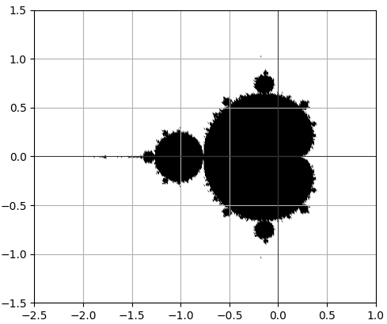

# Fractal in Python

## Table of Contents

- [Project Objective](#Project-Objective)
- [Python Libraries](#Python-Libraries-Used)
- [Visual Goals](#Visual-Goals)
- [Project Status](#Project-Status)


## Project Objective

The goal of this little project is to recreate factals (the Mandelbrot and Julia set) with my current knowledge of Python.
I might use other languages if I encounter limitations in computation or visualization (possibly using shaders later on).

## Python Libraries Used

- Numpy
- Matplotlib

## Visual Goals


The ultimate goal of this project is to achieve a visual aspect resembling the one above initially. To accomplish this, I am utilizing the Matplotlib library to quickly create an initial visual representation using its powerful graphing capabilities. Matplotlib provides a solid foundation for visualization, allowing me to visualize fractals efficiently.  
<br/><br/>
As the project progresses, if I encounter certain limitations or if I aim to enhance the visual aesthetics further, I may explore additional visualization techniques or potentially incorporate advanced features such as shaders. The flexibility of Matplotlib allows me to start with a strong visual foundation and expand upon it as needed.

## Project Status

Project Devlog : 

- Drawing the Mandelbrot set with Matplotlib.pyplot
<p align="left">
  
</p>
  
- Calculating the value of Zn on the Mandelbrot set
```python
def Computes_Z(complex, max_iterations = 100):
    z = 0
    for i in range(max_iterations):
        z = z * z + complex
        yield z

def ComputesMandelbrot(complex, max_iterations = 100):
    for n, z_nbr in enumerate(Computes_Z(complex, max_iterations)):
        if(abs(z_nbr) > 2.0):
            return n
        
    return max_iterations
```
